<!-- DO NOT EDIT THIS FILE, EDIT README_TEMPLATE.md, this README.md is auto generated. -->

# Dank Material Shell Plugins

This repository contains a collection of plugins for [Dank Material Shell](https://github.com/AvengeMedia/DankMaterialShell)

[https://plugins.danklinux.com/](https://plugins.danklinux.com/)

## Contributing

To add your Plugin to the list please read the [contribution guidelines](CONTRIBUTING.md) and create a pull request.

## Installing Plugins

### Via DMS Settings UI

On DMS open the settings <kbd>Mod + ,</kbd> go to **Plugins** tab and click on **Browse** button.

### Via dms CLI

On your teminal run `dms` then navigate to the **plugins** option or run `hype plugins install {plugin-name}` directly.

### Manually

Clone the plugin repository into your `~/.config/DankMaterialShell/plugins/` folder and restart your dms session with `hype restart`. NOTE: Some plugins may have additional dependencies that need to be installed manually, please refer to the plugin documentation for more information, some plugins are part of a monorepo and need to be installed by copying the relevant path to the plugins folder.

### With Nix

Follow the [Nix usage documentation](/nix/README.md)

## Disclaimer

Some plugins are created by third-party developers and are not officially supported by the Dank Material Shell team. Use them at your own risk. In case of issues, please contact the plugin author directly.

## Plugins

**Categories:** [Utilities](#utilities)

---

### Utilities

#### [Phone Companion](https://github.com/acarlton5/Hype-Plugin-PhoneCompanion)

Control connected devices through KDE Connect or Valent: view battery status, send files, find a phone, share clipboard content, and send SMS messages.

- id: hypeKDEConnect
- name: Phone Companion
- author: Avenge Media
- compositors: hyprland
- capabilities: hypebar-widget
- dependencies: kdeconnect
- distro: any

Screenshot

#### [Voice Input](https://github.com/acarlton5/Hype-Plugin-Voice2Text)

Private on-device speech-to-text with a floating listening and processing orb that inserts transcription into the focused field.

- id: hypeVoiceInput
- name: Voice Input
- author: acarlton5
- compositors: hyprland
- capabilities: hypebar-widget
- dependencies: pipewire, whisper.cpp, wtype, wl-clipboard
- distro: any

---

## Themes

### 1-Bit

Monochrome based theme

- **Author:** HyDE community, converted for HypeShell
- **ID:** `theme1Bit` **Version:** `0.1.2`

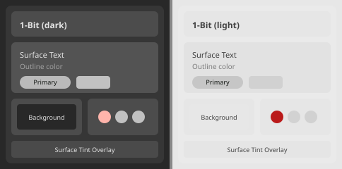

### AbyssGreen

AbyssGreen is a theme based on the Everforst color scheme

- **Author:** HyDE community, converted for HypeShell
- **ID:** `abyssgreen` **Version:** `0.1.3`

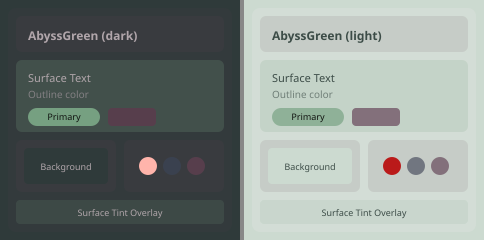

### Abyssal-Wave

Dive into the deep, where elegance meets the infinite night.

- **Author:** HyDE community, converted for HypeShell
- **ID:** `abyssalWave` **Version:** `0.1.2`

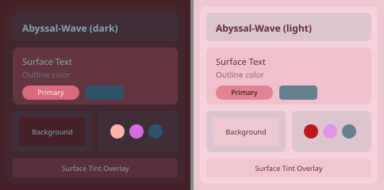

### Amethyst-Aura

A vibrant purple-themed style with ethereal accents

- **Author:** HyDE community, converted for HypeShell
- **ID:** `amethystAura` **Version:** `0.1.2`

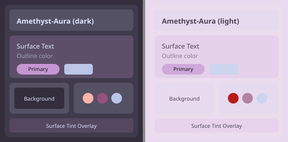

### AncientAliens

A futuristic alien-like theme. Designed to invoke the feelings of watching the History channel at three in the morning.

- **Author:** HyDE community, converted for HypeShell
- **ID:** `ancientaliens` **Version:** `0.1.8`

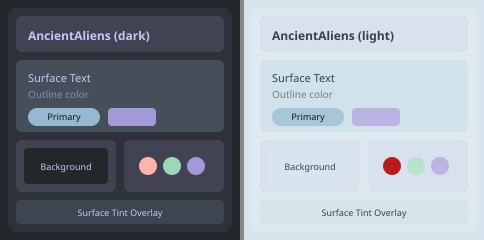

### Another World

Step beyond the horizon, where reality fades and imagination reigns supreme.

- **Author:** HyDE community, converted for HypeShell
- **ID:** `anotherWorld` **Version:** `0.1.2`

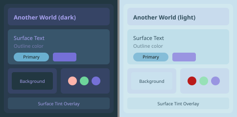

### Bad Blood

Red & Black based theme.

- **Author:** HyDE community, converted for HypeShell
- **ID:** `badBlood` **Version:** `0.1.2`

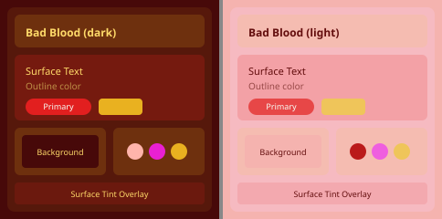

### BlueSky

A serene theme inspired by bright cloudy skies

- **Author:** HyDE community, converted for HypeShell
- **ID:** `bluesky` **Version:** `0.1.2`

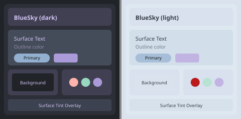

### Breezy Autumn

Autumn, what a cozy time...

- **Author:** HyDE community, converted for HypeShell
- **ID:** `breezyAutumn` **Version:** `0.1.2`

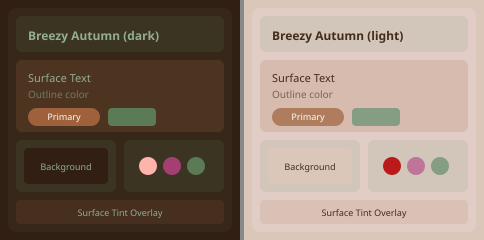

### Cat Latte

Better Catppuccin-Latte that fixes the inconsistencies of the official theme

- **Author:** HyDE community, converted for HypeShell
- **ID:** `catLatte` **Version:** `0.1.2`

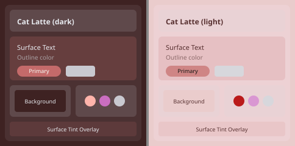

### Catppuccin Latte

Official Theme

- **Author:** HyDE community, converted for HypeShell
- **ID:** `catppuccinLatte` **Version:** `0.1.2`

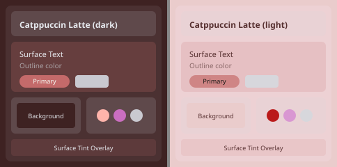

### Catppuccin Mocha

Official Theme

- **Author:** HyDE community, converted for HypeShell
- **ID:** `catppuccinMocha` **Version:** `0.1.2`

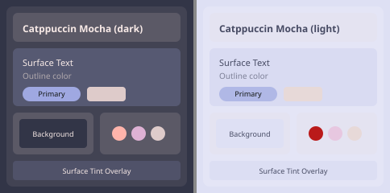

### Catppuccin-Macchiato

Catppuccin Macchiato with Mauve Accent

- **Author:** HyDE community, converted for HypeShell
- **ID:** `catppuccinMacchiato` **Version:** `0.1.2`

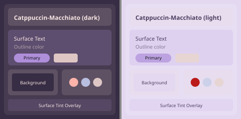

### Chisa

HyDE theme inspired by Chisa from Wuthering Waves.

- **Author:** HyDE community, converted for HypeShell
- **ID:** `chisa` **Version:** `0.1.2`

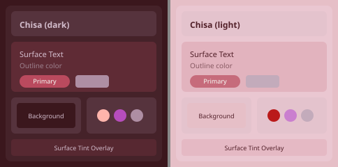

### Code Garden

A sleek and transparent, color-agnostic theme.

- **Author:** HyDE community, converted for HypeShell
- **ID:** `codeGarden` **Version:** `0.1.2`

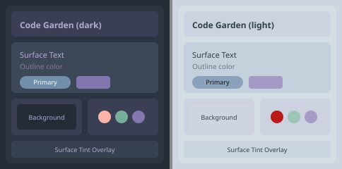

### Cosmic Blue

Out there, somewhere in our galaxy...

- **Author:** HyDE community, converted for HypeShell
- **ID:** `cosmicBlue` **Version:** `0.1.2`

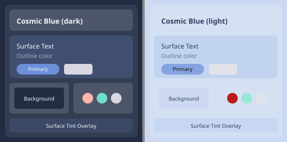

### Crimson Blade

A striking fusion of sharp elegance, cutting through the darkness with bold hues.

- **Author:** HyDE community, converted for HypeShell
- **ID:** `crimsonBlade` **Version:** `0.1.2`

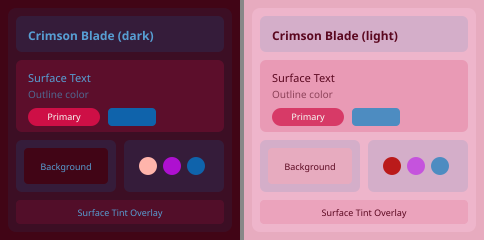

### Crimson-Blue

Red with Blue vibes

- **Author:** HyDE community, converted for HypeShell
- **ID:** `crimsonBlue` **Version:** `0.1.2`

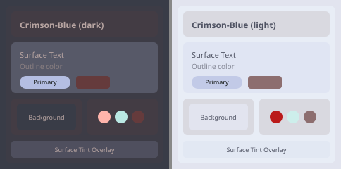

### Decay Green

Official Theme

- **Author:** HyDE community, converted for HypeShell
- **ID:** `decayGreen` **Version:** `0.1.2`

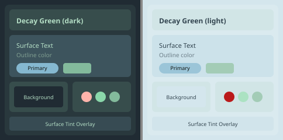

### DoomBringers

When shadows catch fire, sharp edges leave their mark.

- **Author:** HyDE community, converted for HypeShell
- **ID:** `doombringers` **Version:** `0.1.2`

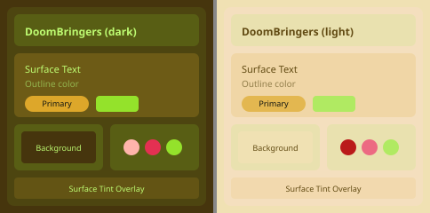

### Dracula

Dracula based theme

- **Author:** HyDE community, converted for HypeShell
- **ID:** `dracula` **Version:** `0.1.2`

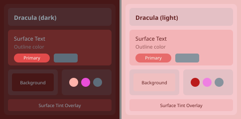

### Edge Runner

Official Theme

- **Author:** HyDE community, converted for HypeShell
- **ID:** `edgeRunner` **Version:** `0.1.2`

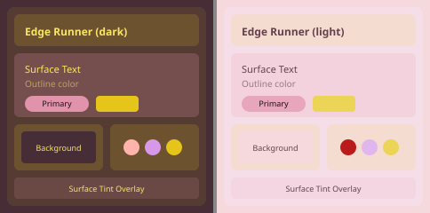

### Electra

Where darkness meets brilliance

- **Author:** HyDE community, converted for HypeShell
- **ID:** `electra` **Version:** `0.1.2`

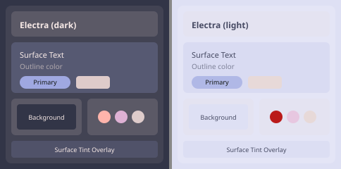

### Eternal Arctic

Serene Nord-inspired theme having frosty aesthetic blues

- **Author:** HyDE community, converted for HypeShell
- **ID:** `eternalArctic` **Version:** `0.1.2`

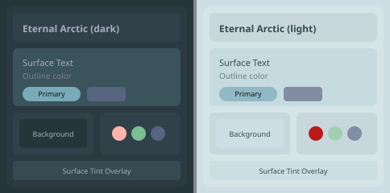

### Ever Blushing

Ever-Blush inspired dark aesthetic minimal theme

- **Author:** HyDE community, converted for HypeShell
- **ID:** `everBlushing` **Version:** `0.1.2`

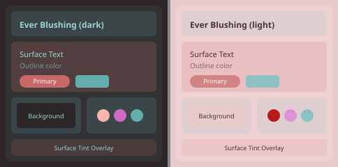

### Frosted Glass

Official Theme

- **Author:** HyDE community, converted for HypeShell
- **ID:** `frostedGlass` **Version:** `0.1.2`

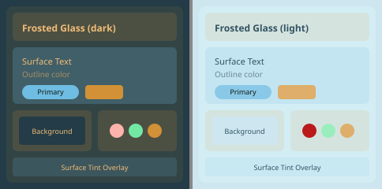

### Graphite Mono

Official Theme

- **Author:** HyDE community, converted for HypeShell
- **ID:** `graphiteMono` **Version:** `0.1.2`

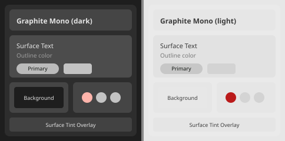

### Green Lush

A ghibli based theme for Hyde

- **Author:** HyDE community, converted for HypeShell
- **ID:** `greenLush` **Version:** `0.1.2`

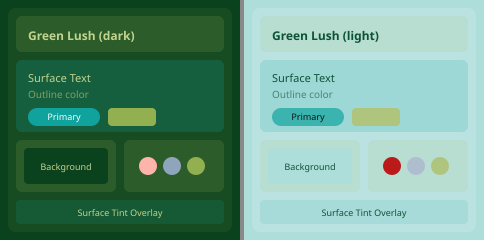

### Greenify

Dark Green based theme for Hyde

- **Author:** HyDE community, converted for HypeShell
- **ID:** `greenify` **Version:** `0.1.2`

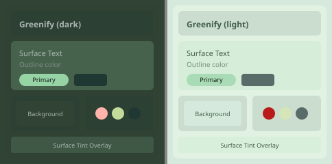

### Grukai

Where retro warmth meets modern edge

- **Author:** HyDE community, converted for HypeShell
- **ID:** `grukai` **Version:** `0.1.2`

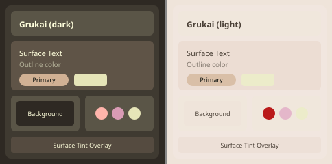

### Gruvbox Retro

Official Theme

- **Author:** HyDE community, converted for HypeShell
- **ID:** `gruvboxRetro` **Version:** `0.1.2`

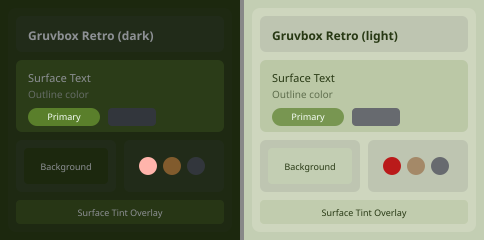

### Hack the Box

Hacker based theme

- **Author:** HyDE community, converted for HypeShell
- **ID:** `hackTheBox` **Version:** `0.1.2`

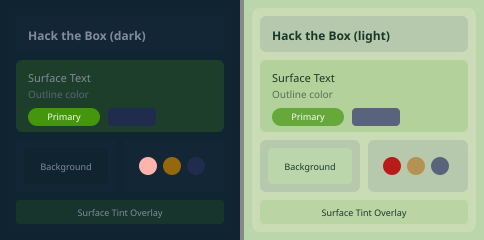

### Ice Age

Winter based Ice Age theme for Hyde

- **Author:** HyDE community, converted for HypeShell
- **ID:** `iceAge` **Version:** `0.1.2`

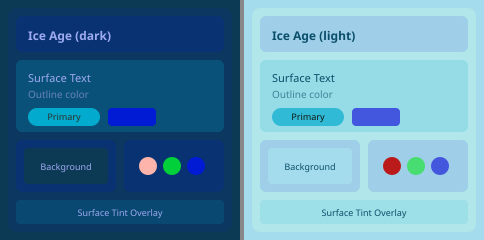

### Joker

Its for you Izumi.

- **Author:** HyDE community, converted for HypeShell
- **ID:** `joker` **Version:** `0.1.2`

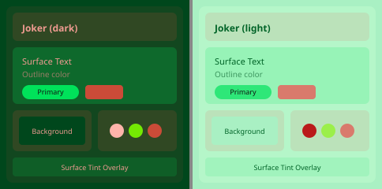

### LimeFrenzy

Lime’s rhythm splits the night, where chaos crafts the vibe.

- **Author:** HyDE community, converted for HypeShell
- **ID:** `limefrenzy` **Version:** `0.1.2`

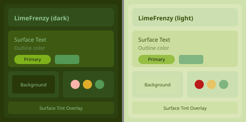

### Mac OS

Official Theme

- **Author:** HyDE community, converted for HypeShell
- **ID:** `macOs` **Version:** `0.1.2`

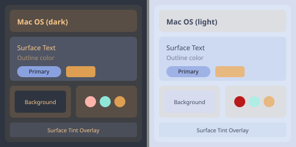

### Material Sakura

Official Theme

- **Author:** HyDE community, converted for HypeShell
- **ID:** `materialSakura` **Version:** `0.1.2`

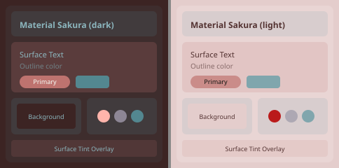

### Monokai

Monokai based theme for Hyde

- **Author:** HyDE community, converted for HypeShell
- **ID:** `monokai` **Version:** `0.1.2`

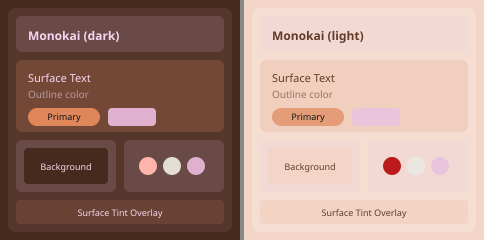

### Monterey Frost

Mac-OS inspired dark theme

- **Author:** HyDE community, converted for HypeShell
- **ID:** `montereyFrost` **Version:** `0.1.2`

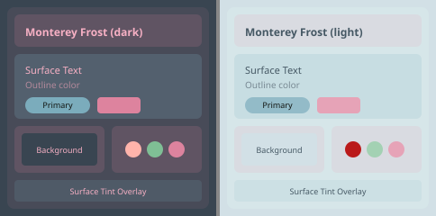

### Moonlight

Gentle, soft moonlight lingers on my face...

- **Author:** HyDE community, converted for HypeShell
- **ID:** `moonlight` **Version:** `0.1.2`

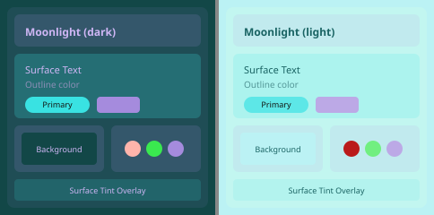

### Nier

Green dominant Nier Inspired Theme.

- **Author:** HyDE community, converted for HypeShell
- **ID:** `nier` **Version:** `0.1.2`

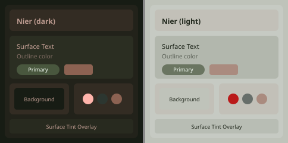

### Nightbrew

A rich, dark theme crafted for late-night productivity and sleek aesthetics.

- **Author:** HyDE community, converted for HypeShell
- **ID:** `nightbrew` **Version:** `0.1.2`

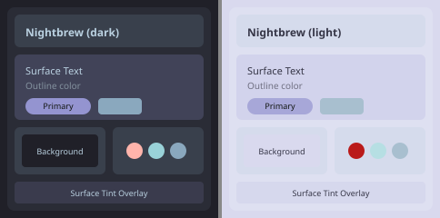

### Nordic Blue

Official Theme

- **Author:** HyDE community, converted for HypeShell
- **ID:** `nordicBlue` **Version:** `0.1.2`

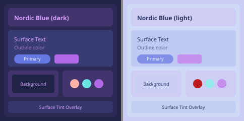

### Obsidian-Purple

Where mystery meets elegance.

- **Author:** HyDE community, converted for HypeShell
- **ID:** `obsidianPurple` **Version:** `0.1.2`

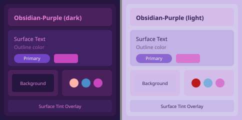

### One Dark

One Dark based theme

- **Author:** HyDE community, converted for HypeShell
- **ID:** `oneDark` **Version:** `0.1.2`

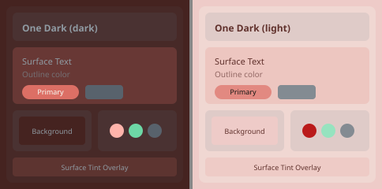

### Oregairu

HyDE theme inspired by Oregairu

- **Author:** HyDE community, converted for HypeShell
- **ID:** `oregairu` **Version:** `0.1.2`

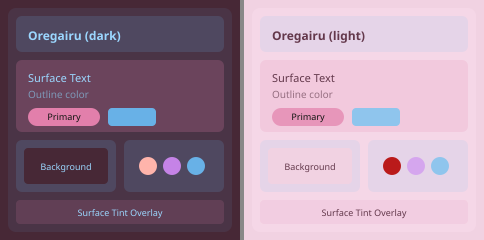

### Oxo Carbon

Oxo Carbon based theme for Hyde

- **Author:** HyDE community, converted for HypeShell
- **ID:** `oxoCarbon` **Version:** `0.1.2`

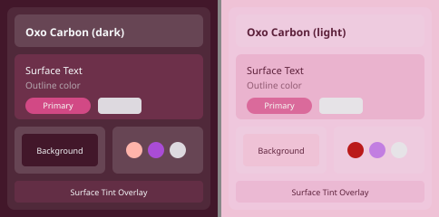

### Paranoid Sweet

Dark purple based theme for HyDE

- **Author:** HyDE community, converted for HypeShell
- **ID:** `paranoidSweet` **Version:** `0.1.2`

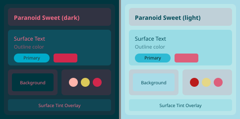

### Peace Of Mind

Finally, some peace of mind...

- **Author:** HyDE community, converted for HypeShell
- **ID:** `peaceOfMind` **Version:** `0.1.2`

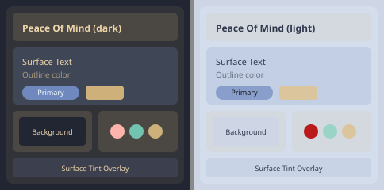

### Pixel Dream

Pixel Art inspired theme

- **Author:** HyDE community, converted for HypeShell
- **ID:** `pixelDream` **Version:** `0.1.2`

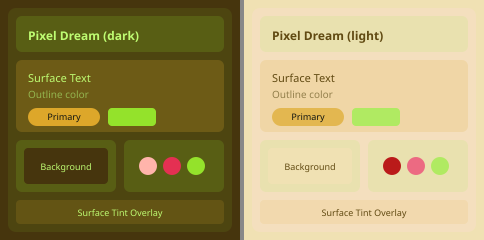

### Rain Dark

Cozy new Rain based theme for HyDE

- **Author:** HyDE community, converted for HypeShell
- **ID:** `rainDark` **Version:** `0.1.2`

### Red Stone

Hot Red based theme

- **Author:** HyDE community, converted for HypeShell
- **ID:** `redStone` **Version:** `0.1.2`

### Rosé Pine

Official Theme

- **Author:** HyDE community, converted for HypeShell
- **ID:** `rosePine` **Version:** `0.1.2`

### Scarlet Night

Hot-Red + Deep-Black

- **Author:** HyDE community, converted for HypeShell
- **ID:** `scarletNight` **Version:** `0.1.2`

### Solarized Dark

Solarized Dark based theme for HyDE

- **Author:** HyDE community, converted for HypeShell
- **ID:** `solarizedDark` **Version:** `0.1.2`

### Soulsborne

HyDE theme inspired by the Soulsborne series.

- **Author:** HyDE community, converted for HypeShell
- **ID:** `soulsborne` **Version:** `0.1.2`

### Synth Wave

Official Theme

- **Author:** HyDE community, converted for HypeShell
- **ID:** `synthWave` **Version:** `0.1.2`

### Timeless Dream

Maybe, it's all just a dream...

- **Author:** HyDE community, converted for HypeShell
- **ID:** `timelessDream` **Version:** `0.1.2`

### Tokyo Night

Official Theme

- **Author:** HyDE community, converted for HypeShell
- **ID:** `tokyoNight` **Version:** `0.1.2`

### Tundra

A Soothing, Pastel Tundra Theme.

- **Author:** HyDE community, converted for HypeShell
- **ID:** `tundra` **Version:** `0.1.2`

### Vanta Black

Vanta Black inspired theme having the deepest blacks

- **Author:** HyDE community, converted for HypeShell
- **ID:** `vantaBlack` **Version:** `0.1.2`

### Virtual-Witches

HyDE theme based on Catppuccin Frappe and Virtual Witch Phenomenon

- **Author:** HyDE community, converted for HypeShell
- **ID:** `virtualWitches` **Version:** `0.1.2`

### Windows 11

We love Windows! Wew

- **Author:** HyDE community, converted for HypeShell
- **ID:** `windows11` **Version:** `0.1.2`

